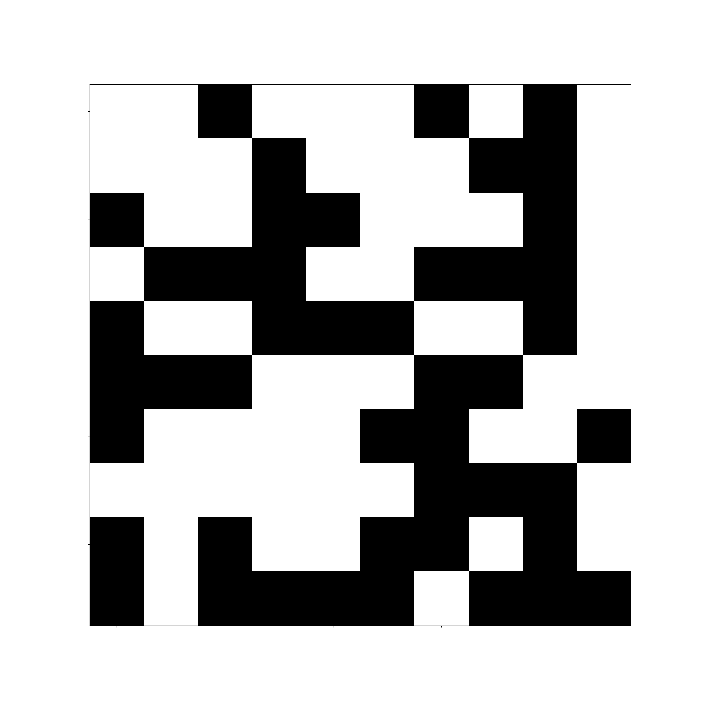
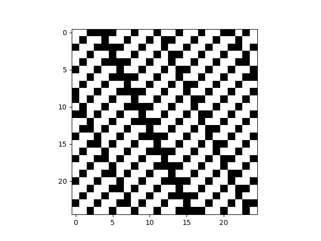

These scripts can be used to generate grids of random dots with different colours, black and white noise, any pixel draws and patterns like a chess board.

Black and white noise
black_and_white_noise.py

You can set the dimension of your grid.
In the example there are grids of 10x10, 100x100 and 1000x1000

You can set a different probability for each colour.
In the example I set probability 100:1, 10:1, 1:1, 1:10 and 1:100

You can also set a gradient of probability for each colour.

You can choose as many colours as you like.

You can have change the layout of the blocks, they can also have a frame.

You can also save a grid or draw it using 0 and 1 or as many colours as you want.
draw_with_grid.py

You can also generate a pattern.
In the example I generated a chess board pattern.
chess_board.py

You can generate many other patterns. You can also create random patterns.
Pattern_generator.py

You can also use trigonometric functions (cos(x), sin(x)) to generate a pattern.

